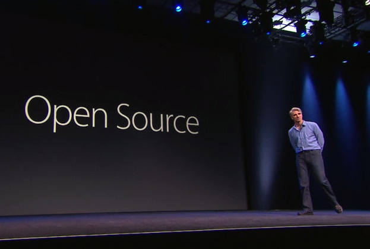
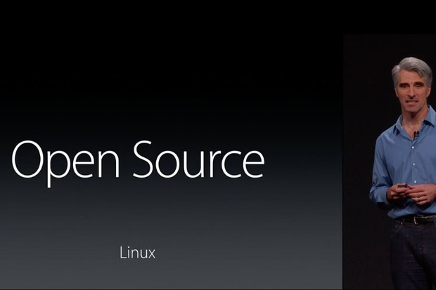
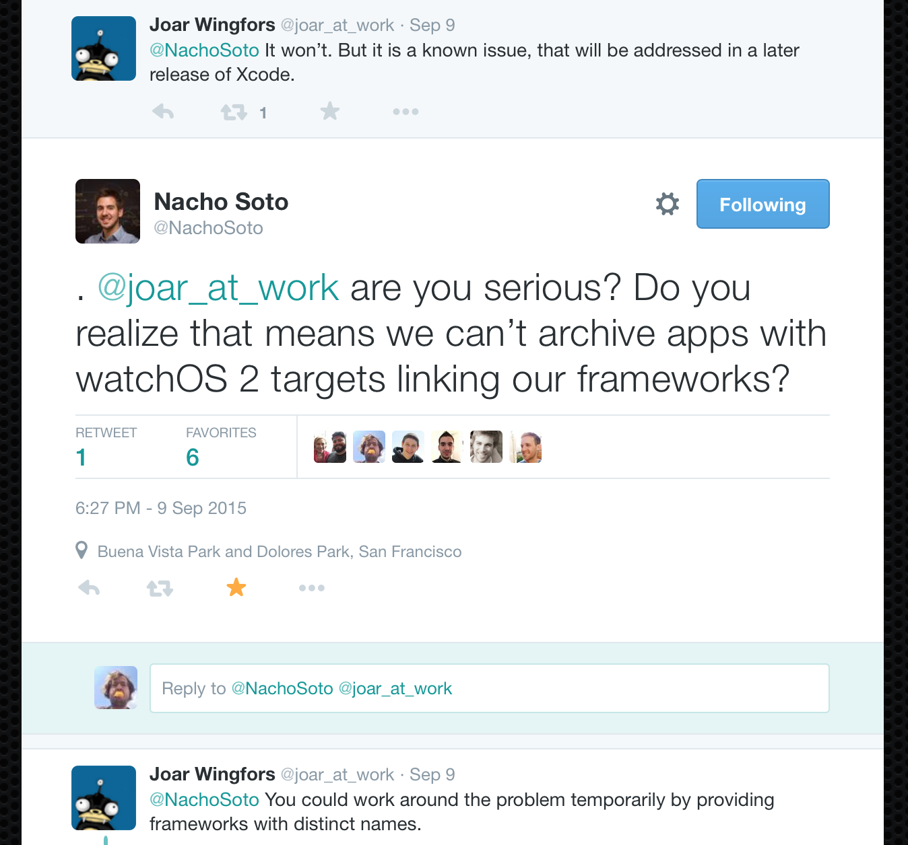
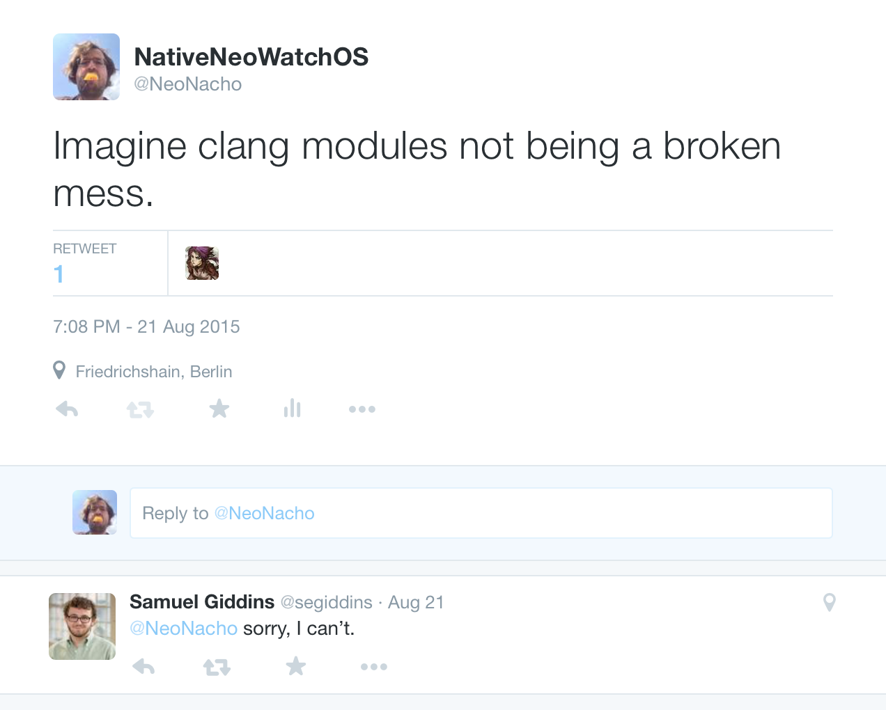
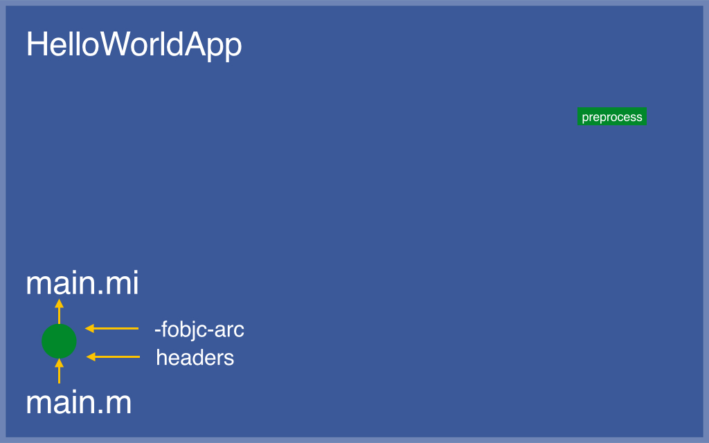
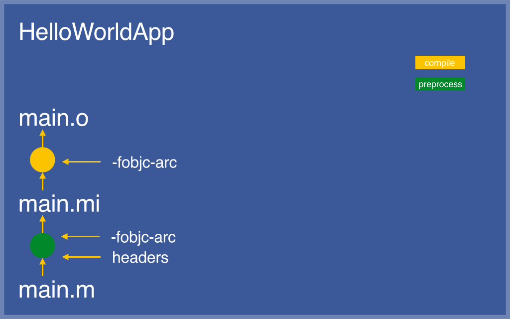
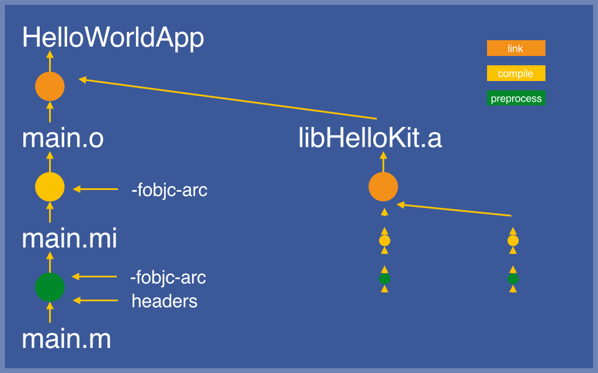
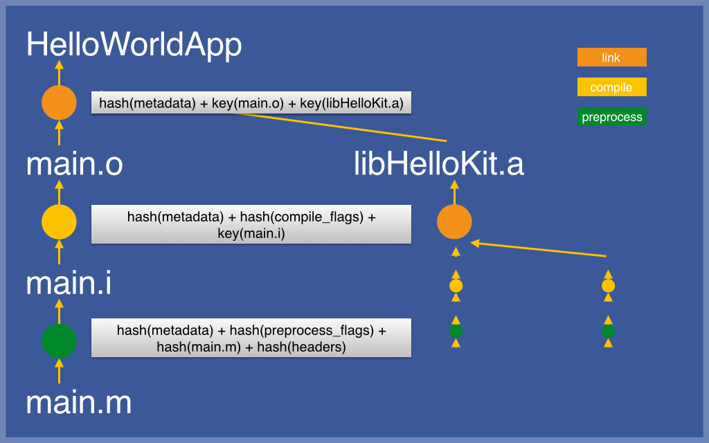

# Bringing CocoaPods to Linux

## NSSpain, September 2015

### Boris Bügling - @NeoNacho


<!--- use Sketchnote theme, white -->

---

# CocoaPods


dependency management ✅

---

# Contentful


content management ✅

---

# Agenda

- Why?
- Xcode's build system
- How does CocoaPods interact with it?
- Alternatives
- Plan


---


---



---



---

# No Xcode on Linux


---

# Xcode is broken


---

# ya tu sabes


---

# Just two examples

- Archiving watchOS 2.0 apps
- CLANG\_ENABLE\_MODULES


---

### [Xcode 7 beta] Linking dual (iphoneos and watchos) frameworks with same product name causes archive to fail

<http://openradar.appspot.com/22392501>


---




---

## CLANG\_ENABLE\_MODULES


---

> Enables the use of modules for system APIs.  System headers are imported as semantic modules instead of raw headers.


---

# "system APIs" == any framework outside your target 😂


---




---

# Bring back CocoaPods to its core and move rest (e.g. Xcode integration) into plugins. #2729

From October 2014

<https://github.com/CocoaPods/CocoaPods/issues/2729>


---

> Let's face it, programming sucks.


---

# Xcode's build system


---

- Fairly old (`Xcode3Core.ideplugin`)
- Entirely based on mtimes
- Poorly documented


---

# De-facto documentation

- <http://pewpewthespells.com/blog/managing_xcode.html>
- <http://pewpewthespells.com/blog/buildsettings.html>


---

# Xcode project files 🙈🙊🙉


---

# Tomorrow 16:30 - 17:00

## Grant Paul - Making Sense of Xcode


---

# How does CocoaPods interact with it?


---

# Alternatives


---

# Makefiles


---

```makefile
package: $(EXECUTABLE_NAME) $(INFO_PLIST)
	mkdir -p "$(PRODUCT_NAME).app"
	@/bin/echo -n 'AAPL' > "$(PRODUCT_NAME).app/PkgInfo"
	@$(PLBUDDY) -c 'Print CFBundleSignature' $(INFO_PLIST) \
		>> "$(PRODUCT_NAME).app/PkgInfo"
	cp $(EXECUTABLE_NAME) "$(PRODUCT_NAME).app"
	$(BASE_DIR)/sh/build_plist $(INFO_PLIST) "$(PRODUCT_NAME).app/Info.plist"
	$(BASE_DIR)/sh/build_ipa "$(PRODUCT_NAME).app"

$(EXECUTABLE_NAME): $(OBJS)
	$(LD) $(CFLAGS) $(LDFLAGS) -o $@ $^
```


---

# Makefiles

- Build rules to transform files (e.g. `.m` => `.o`)
- Based on mtimes
- "Phony" rules which run unconditionally
- Dependencies to files or other rules
- Exists everywhere


---

# Rules

```makefile
target: dependencies
	build step(s)
```


---

# Execution

```bash
make [options] [target1 target2 ...]
```


<!-- more transparency, but same flawed build process -->

---

# Buck


<!-- https://buckbuild.com/ -->

---


---



---



---



---



---

=> no more DerivedData nonsense 🎉


---

# Installation

```bash
$ brew update
$ brew tap facebook/fb
$ brew install --HEAD buck
```


---

# Quickstart

```bash
$ buck quickstart --type ios --dest-dir .
[...]
$ buck build demo_app_ios
[...]
$ ls buck-out/gen/ios/BuckDemoApp
BuckDemoApp.app  BuckDemoApp.dSYM
```


---

# Initial build

```bash
$ buck build demo_app_ios
[...]
[-] BUILDING...FINISHED 2.4s (8/8 JOBS, 8 UPDATED, 0.0% CACHE HITS)
```

# Subsequent builds

```bash
$ buck build demo_app_ios
[...]
[-] BUILDING...FINISHED 0.0s (1/8 JOBS, 0 UPDATED)
```


---

# BUCK

```python
apple_binary(
  [...]
)

xcode_project_config(
  name = 'Hello',
  src_target = ':Hello',
  action_config_names={'profile': 'Profile'}
)
```


---

# Source files

```python
srcs = [
    'Code/AppDelegate.m'
    'Code/ViewController.m',
    'Code/main.m',
],
```


---

# Headers

```python
headers = [
    'Code/AppDelegate.h'
    'Code/ViewController.h',
],
```


---

# Linked frameworks

```python
frameworks = [
    '$SDKROOT/System/Library/Frameworks/Foundation.framework',
    '$SDKROOT/System/Library/Frameworks/UIKit.framework',
],
```


---

# Dependencies

```python
deps = [
    '//Libraries/EXExample:EXExample',
],
```


---

# Plan


---

- Xcode's build system
- How does CocoaPods interact with it?
- Breaking the strong coupling with a new abstraction
- Discussion of replacement build systems:
	- GNU Makefiles
	- Buck
- Notes on the concrete implementation inside CocoaPods

---

# Thanks!


---

https://www.facebook.com/events/1495505997428211/

# _

@NeoNacho

boris@contentful.com

http://buegling.com/talks


